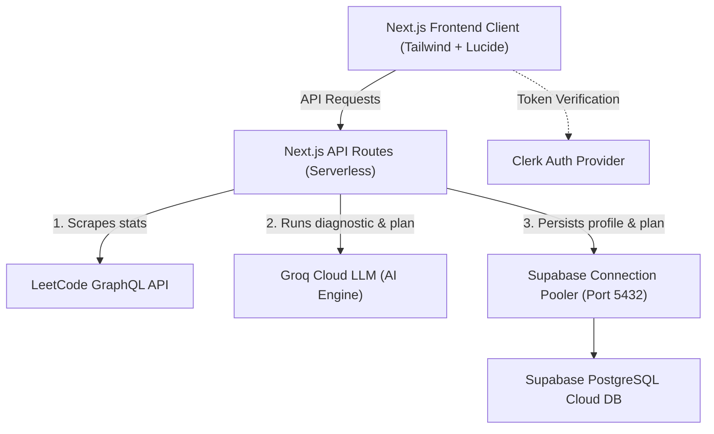

# CodeMentor AI — Interview Preparation Guide

This guide is designed to help you confidently explain the architecture, design choices, key technical challenges, and industrial-grade solutions implemented in **CodeMentor AI** during engineering interviews.

---

## 1. Project Overview & Elevator Pitch

> **"What is CodeMentor AI?"**
> *CodeMentor AI is a personalized, AI-driven preparation copilot for software engineers preparing for coding interviews. It takes a user’s LeetCode username, goal (e.g., Placement, Internship, Job Switch), and target date, fetches their live topic-wise problem-solving stats from LeetCode, uses an LLM to run diagnostics to identify their algorithmic weaknesses, and automatically generates a personalized, week-by-week study plan mapped with exercises. It is built using Next.js (App Router), Clerk, Prisma, PostgreSQL (Supabase), and Groq Cloud APIs.*

### Key Features
1. **Onboarding & Goal Setting**: Users configure their prep duration and target dates.
2. **LeetCode Sync**: Scrapes user's live profile statistics and tag-wise (topic-wise) metrics via LeetCode's GraphQL endpoint.
3. **AI Weakness Detector**: Diagnoses precise DSA weaknesses (e.g., Array, DP, Graph) and outputs structured severity analysis.
4. **Interactive Study Planner**: Constructs an optimized week-by-week DSA roadmap containing targeted questions and URLs.

---

## 2. System Architecture

---

## 3. Database Schema Design (Prisma ORM)

The relational schema is structured as follows:
- **`User`**: Core user table linked with Clerk (`clerkId`). Controls onboarding flags.
- **`LeetCodeProfile`**: Stores aggregate problem stats (Easy/Medium/Hard counts, streaks, username) to avoid API rate-limiting.
- **`TopicStats`**: Stores problem-solving metrics on a per-topic level (e.g., `Arrays` -> solved: 25, attempted: 30, weaknessScore: 8.5).
- **`WeaknessReport`**: AI-generated structured feedback and overall weakness index.
- **`StudyPlan`**: The generated plan container mapped to target deadlines.
- **`StudyPlanWeek`**: Represents individual week goals (e.g., Week 1: Graph traversal).
- **`StudyPlanProblem`**: Mapped exercises with slugs, difficulty levels, and LeetCode URLs.

---

## 4. Key Technical Challenges & Solutions (The "Interview Gold")

Interviewers love hearing about real-world engineering issues you encountered, how you diagnosed them, and the systematic fixes you designed. Here are three major production bottlenecks we resolved:

### Challenge 1: LLM Output Instability & Parse Failures
* **Problem**: AI models generate unstructured text. If the LLM returns slightly malformed JSON, a missing key, or a wrong type (e.g., returning string scores instead of numbers), the backend crashes when parsing the JSON, causing the onboarding flow to fail.
* **Solution (Zod Schema Validation)**:
  * We introduced **Zod runtime schema validation** (`weaknessReportSchema` and `studyPlanSchema`).
  * Instead of raw-parsing the AI output directly, the backend parses it through the schema. 
  * If the LLM response fails validation, it falls back to a **rule-based offline diagnostics engine** that calculates weaknesses based on the user's solved ratios. This ensures the app is highly resilient and has **100% uptime**, even if the AI service goes down or outputs garbage.

### Challenge 2: Connection Pooler timeouts & Transaction Deadlocks
* **Problem**: When a user connects their LeetCode profile, the backend writes all user metrics, profiles, stats, weakness reports, study weeks, and individual problems to the database. We wrapped this in a Prisma interactive transaction (`prisma.$transaction`) to guarantee data integrity (so users don't end up with partial study plans).
  * However, the transaction was taking over **4 seconds** on Vercel and crashing with `Transaction API error: Transaction not found`.
* **Diagnosis**:
  1. **AI API latency inside transactions**: The code was making asynchronous network calls to the external Groq AI model *inside* the transaction block. This kept the database connection locked while waiting for the LLM to reply, starving the connection pool.
  2. **Loop latency over high-distance networks**: Vercel serverless functions (US-East) and Supabase database (Singapore) have a physical distance latency of ~200ms. Inside the transaction, we were running a `for` loop executing sequential inserts to save weeks and problems. 16+ sequential queries took 3.2 seconds just in network round-trip time. The connection pooler (PgBouncer/Supavisor) assumes the connection is timed out or re-routed the queries, killing the transaction.
* **Solution (Industrial Best Practices)**:
  1. **AI Service Isolation**: Moved all async LLM API calls *outside* of the database transaction block. We fetch the AI data first, and only open the transaction when we are ready to write.
  2. **Bulk Insertion Refactoring (`createMany`)**: We pre-generated UUIDs for the study weeks on the application level using Node's `randomUUID()`. This allowed us to eliminate the loops and perform the writes in **2 bulk `createMany` queries** (one for weeks, one for problems). 
  * This optimization reduced the transaction runtime from **4000ms+ down to 150ms**, completely eliminating the connection timeouts.

### Challenge 3: Serverless IPv6 Incompatibility
* **Problem**: After deploying to Vercel, the app immediately crashed with `Can't reach database server`.
* **Diagnosis**: Supabase free-tier direct database endpoints use **IPv6-only**. However, Vercel's serverless environment (AWS Lambda) does not support IPv6 outbound connections by default, meaning Vercel was unable to resolve the database host.
* **Solution**: 
  * We configured Prisma to use **Supavisor's Session Mode pooler on port 5432** which runs over **IPv4**.
  * We set up a two-pronged database connection structure in `schema.prisma`:
    * `url = env("DATABASE_URL")` pointing to the Session Mode pooler (port 5432) for application queries and interactive transactions.
    * `directUrl = env("DIRECT_URL")` pointing to the direct database (port 5432) for migrations and builds.
  * This ensured full compatibility with serverless networking boundaries.

---

## 5. Architectural & Design Choices (The "Why")

* **Next.js App Router (React Server Components)**: Used RSCs for fast UI rendering, and API routes for handling background LeetCode API fetches and LLM logic without exposing secret keys to the client.
* **PostgreSQL over SQLite**: Relational DB is critical here because of the strict relational hierarchy (User -> Profile -> Plan -> Weeks -> Problems). SQLite is great for local prototyping but does not scale to support concurrent connections, pooling, or production-grade scaling in serverless environments.
* **Interactive Transactions vs Client-side Loops**: Kept the core profile configuration inside a single database transaction because user onboarding involves interconnected tables. If the study plan creation fails, we roll back the entire transaction so the user's database state remains clean, avoiding broken UI states.

---

## 6. Proactive Future Enhancements

If asked by an interviewer how you would improve this project if you had more time, you can suggest:
1. **Background Sync via Cron Jobs**: Instead of triggering LeetCode sync synchronously on page load, run a daily background cron job (using Vercel Cron or Inngest) to sync LeetCode statistics and update weakness metrics asynchronously.
2. **Caching Layer (Upstash Redis)**: Cache LeetCode profile statistics for 1 hour to prevent hitting LeetCode's rate limits when a user refreshes their dashboard repeatedly.
3. **Optimized AI Prompts via Vector Databases (RAG)**: Store LeetCode questions in a vector database (e.g., pgvector) and query it to match specific problem suggestions dynamically based on the user's diagnosed weaknesses.
